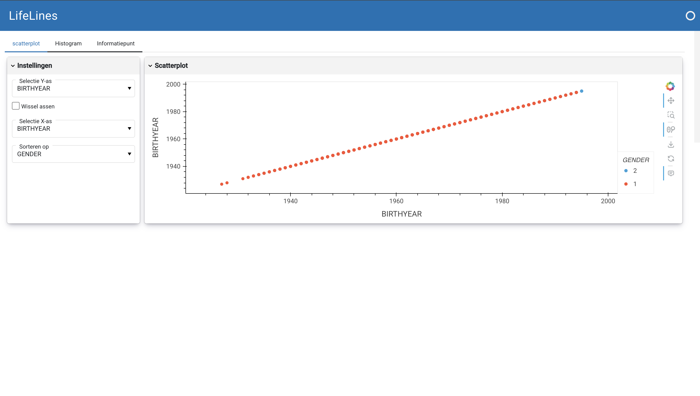
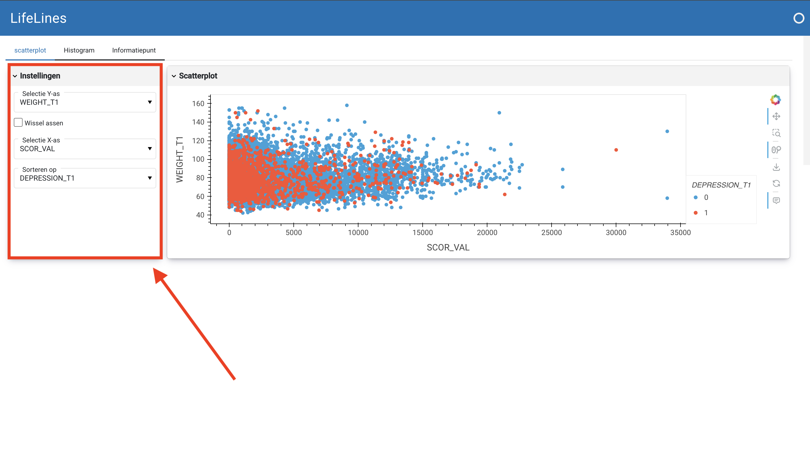
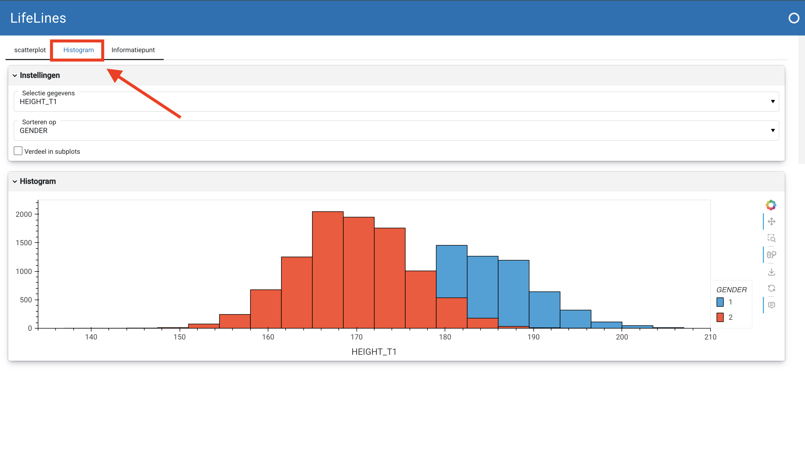

# Lifelines

Welkom gebruiker ! \
Hier zal u lezen hoe u dit programma moet gebruiken. \
Deze website is gemaakt met een dataset van Lifelines. Van de data die hierin staat maakt de site een scatterplot of histogram van de door u gekozen kolommen. Wat deze kolomnamen betekenen staat vermeld in het 'informatiepunt' tablad op de website. Uit deze plots kunt u vervolgens informatie afleiden die gerelateerd is aan de gezondheid van de mensen die mee hebben gedaan met onderzoek bij Lifelines.

## Files:
`app.py` = the project \
`logboek.ipynb` = Het gelogde proces \
`ade.ipynb` = ade
`config.ini` = config file \
`requirements.txt` = benodigde libraries voor dit project

## Wat heeft u nodig om deze website te kunnen gebruiken ?
U heeft de libraries uit het requirements.txt bestand nodig. Ook heeft de een dataset van Lifelines nodig. En een aangepaste metadat bestand. Als u dit bestand niet kan vinden kunt u deze zelf maken van de geleverde metadata. Dit doet u door tussen elke kolomnaam en betekenis een `;` te zetten. \
Verder is het belangrijk dat u een bestand aanmaakt met de naam: `config.ini`. U kunt hierin het onderstaande voorbeeld plakken. Het enige wat u hoeft aan te passen is het pad naar uw data en het pad naar u metadata.

### config.ini voorbeeld:
[FILES]
data = path_to_data_file
metadata = path_to_metadata_file

[SETTINGS]
height = 350
width = 350
var_list = ('BIRTHYEAR', 'AGE_T1', 'AGE_T2', 'AGE_T3', 'ZIP_CODE',
       'BMI_T1', 'WEIGHT_T1', 'HIP_T1', 'HEIGHT_T1', 'WAIST_T1', 'BMI_T2',
       'WEIGHT_T2', 'HIP_T2', 'HEIGHT_T2', 'WAIST_T2', 'HEIGHT_T3',
       'WEIGHT_T3', 'HIP_T3', 'WAIST_T3', 'FINANCE_T1', 'DBP_T1', 'DBP_T2',
       'HBF_T1', 'HBF_T2', 'MAP_T1', 'MAP_T2', 'SBP_T1', 'SBP_T2', 'CHO_T1',
       'GLU_T1', 'CHO_T2', 'GLU_T2', 'LLDS', 'SUMOFALCOHOL', 'SUMOFKCAL', 'MWK_VAL',
       'SCOR_VAL', 'MWK_NO_VAL', 'SCOR_NO_VAL', 'PREGNANCIES', 'C_SUM_T1', 'A_SUM_T1',
       'SC_SUM_T1', 'I_SUM_T1', 'E_SUM_T1', 'SD_SUM_T1', 'V_SUM_T1',
       'D_SUM_T1', 'NSES_YEAR', 'NSES', 'NEIGHBOURHOOD1_T2', 'NEIGHBOURHOOD2_T2',
       'NEIGHBOURHOOD3_T2', 'NEIGHBOURHOOD4_T2', 'NEIGHBOURHOOD5_T2',
       'NEIGHBOURHOOD6_T2', 'MENTAL_DISORDER_T1', 'MENTAL_DISORDER_T2')
groupby_list = ('GENDER','EDUCATION_LOWER_T1',
       'EDUCATION_LOWER_T2', 'WORK_T1', 'WORK_T2',
       'LOW_QUALITY_OF_LIFE_T1', 'LOW_QUALITY_OF_LIFE_T2',
       'HTN_MED_T1', 'RESPIRATORY_DISEASE_T1', 'SMOKING', 'METABOLIC_DISORDER_T1',
       'METABOLIC_DISORDER_T2', 'SPORTS_T1',
       'CYCLE_COMMUTE_T1', 'VOLUNTEER_T1', 'OSTEOARTHRITIS',
       'BURNOUT_T1', 'DEPRESSION_T1', 'SLEEP_QUALITY', 'DIAG_CFS_CDC',
       'DIAG_FIBROMYALGIA_ACR', 'DIAG_IBS_ROME3', 'NEIGHBOURHOOD1_T2', 'NEIGHBOURHOOD2_T2',
       'NEIGHBOURHOOD3_T2', 'NEIGHBOURHOOD4_T2', 'NEIGHBOURHOOD5_T2',
       'NEIGHBOURHOOD6_T2', 'MENTAL_DISORDER_T1', 'MENTAL_DISORDER_T2')

## Hoe gebruik ik de site ?
U opent het `app.py` bestand en vult in in de terminal: \
 `panel serve app.py --dev` \
  ***U moet hier enige tijd geduld hebben, het laden kan enige seconden duren.*** \

Vervolgens klikt u op de melding `open in browser`. De website wordt nu geopent, zie het voorbeeld hieronder: \

U kunt nu bij de instellingen verschillende variabelen selecteren: \

U kunt de plot die vervolgens gegenereerd wordt downloaden met de download knop naast de plot, zie onderstaande screenshot voor de knop: \

Verder kunt u inzoomen in de plot en als u met uw muis beweegt over de verschillende punten in de plot zal de waarde van dit punt weergegeven worden. Zie onderstaande plot:

Verder kunt u als u zich afvraagt wat de verschillende variabelen betekenen naar het tablad `Informatiepunt` gaan:

U kunt ook een histogram genereren, hiervoor gaat u naar het tablad `Histogram`:

Nu weet u hoe u de site kunt gebruiken !

## Vragen ?
Voor vragen kunt u terecht bij github issues op `https://github.com/irisineke/Lifelines`.

## Verdere updates aan de website:
Mogelijk komt er nog een optie om bij de scatterplot de geselecteerde x-as en y-as met een klik om te draaien.

